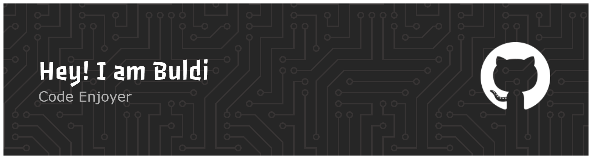

<div align="center">



# 👋 Ciao, sono BuldiDev!

<p align="center">
  <em>Full Stack Developer | Problem Solver | Code Enthusiast</em>
</p>

[](https://github.com/BuldiDev)
[](https://github.com/BuldiDev?tab=followers)
[](https://github.com/BuldiDev)

</div>

---

### 🚀 Chi sono

Sono uno sviluppatore appassionato che ama trasformare idee in codice funzionante. Mi dedico alla creazione di soluzioni innovative e scalabili, con particolare attenzione alla qualità del codice e all'esperienza utente.

```javascript
const buldiDev = {
    code: ["JavaScript", "TypeScript", "Python", "Java", "C++"],
    technologies: {
        frontEnd: ["React", "Vue", "Next.js", "HTML5", "CSS3", "TailwindCSS"],
        backEnd: ["Node.js", "Express", "Django", "Spring Boot"],
        databases: ["MongoDB", "PostgreSQL", "MySQL", "Redis"],
        tools: ["Docker", "Git", "AWS", "Firebase", "Vercel"]
    },
    currentFocus: "Building scalable web applications",
    funFact: "Debug is like being a detective in a crime movie where you are also the murderer"
};
```

---

<div align="center">

## 📊 Statistiche GitHub


</div>

<div align="center">

### 💻 Linguaggi più utilizzati


</div>

---

<div align="center">

## 🏆 Trofei GitHub


</div>

---

### 📈 Grafico delle Contribuzioni

<div align="center">


</div>

---

### 💼 Tech Stack

<div align="center">

#### 🎨 Frontend


#### ⚙️ Backend


#### 🗄️ Database


#### 🛠️ Tools & Platforms


</div>

---

### 📫 Contattami

<div align="center">

[](https://github.com/BuldiDev)
[](mailto:your.email@example.com)
[](https://linkedin.com/in/yourprofile)
[](https://twitter.com/yourhandle)
[](https://yourportfolio.com)

</div>

---

<div align="center">

### 💡 Quote del giorno


### 🎯 Random Dev Joke


---


**⭐ Se i miei progetti ti sono stati utili, considera di lasciarmi una stella!**

</div>
