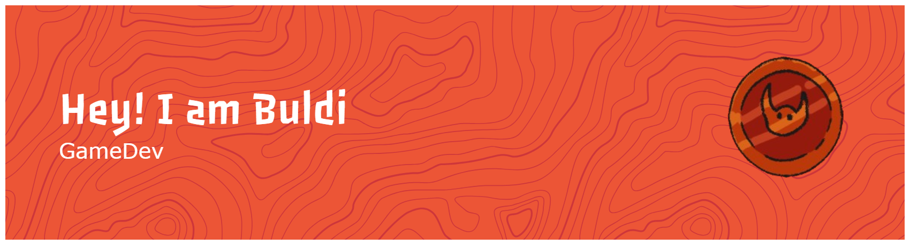

---

### Statistiche GitHub

<table style="border: 2px solid #ffffff; background-color: #0d1117;">
  <tr>
    <td align="center" style="border: 0; padding: 10px;">
      
    </td>
    <td align="center" style="border: 0; padding: 10px;">
      
    </td>
  </tr>
  <tr>
    <td align="center" colspan="2" style="border: 0; padding: 10px;">
      
    </td>
  </tr>
</table>

---

### Trofei

---

### Grafico Contribuzioni

### Tech Stack

---

### Contatti

---

*Se trovi qualcosa di utile qui, lascia una stella*

